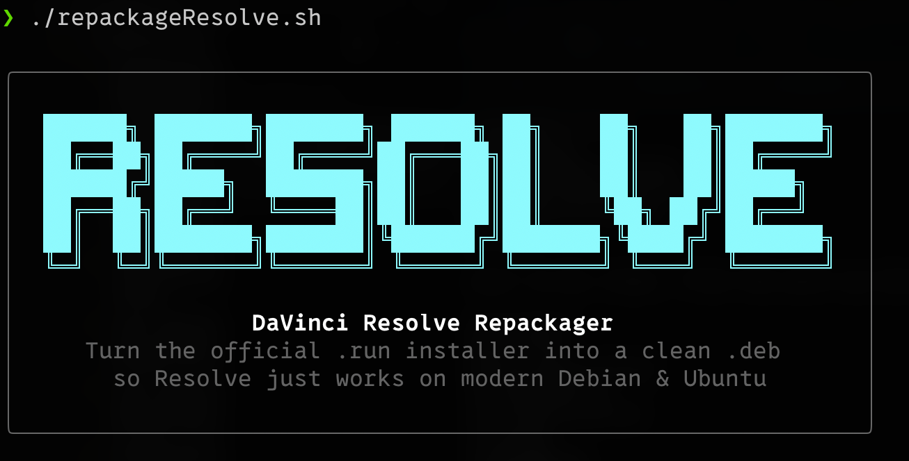
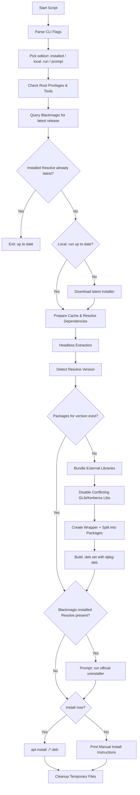

# resolveRepackage

[](https://github.com/iamteedoh/resolveRepackage/actions/workflows/ci.yml)

[](https://github.com/sponsors/iamteedoh)
[](https://patreon.com/iamteedoh)
[](https://buymeacoffee.com/iamteedoh)

## Table of Contents
- [Overview](#overview)
- [Key Features](#key-features)
- [Prerequisites](#prerequisites)
- [Getting Started](#getting-started)
- [Usage](#usage)
  - [Run Modes and Flags](#run-modes-and-flags)
  - [What the Script Does](#what-the-script-does)
- [Workflow Diagram](#workflow-diagram)
- [Generated Files](#generated-files)
- [Troubleshooting](#troubleshooting)
- [Updating Resolve](#updating-resolve)
- [Frequently Asked Questions](#frequently-asked-questions)
- [Contributing](#contributing)
- [Security](#security)
- [License](#license)

## Overview
`repackageResolve.sh` downloads the latest DaVinci Resolve for GNU/Linux from Blackmagic Design, converts the official `.run` installer into Debian packages and installs them. The script vendors Resolve’s required legacy libraries inside the package so you can install the editor on modern Debian/Ubuntu systems without downgrading core system libraries while keeping those legacy libraries isolated from the rest of the system. Run it again whenever a new Resolve ships and it upgrades in place.

<p align="center">
  
</p>

## Key Features
- **Both editions:** Installs DaVinci Resolve Studio or the free DaVinci Resolve. The script asks which one on the first run (or takes `--edition studio|free`) and remembers the choice through the installed package, so updates never ask again.
- **Automatic installer fetch:** Looks up the latest stable DaVinci Resolve release from Blackmagic Design and downloads it for you. An up-to-date `.run` already in the directory is reused, and interrupted downloads resume on the next run.
- **One-command upgrades:** `sudo ./repackageResolve.sh --update` compares the installed package with the latest release, exits immediately when nothing is newer, and otherwise downloads, builds and upgrades in place without asking anything. `--check` reports the versions without changing anything.
- **Self-provisioning:** Missing tools (`xz-utils`, `curl`, `jq`, `unzip`, …) are installed through `apt` automatically.
- **Fits the `.deb` format:** Resolve is larger than a single Debian package can hold, so files are spread over a main package plus `-data-N` parts that depend on each other and are always installed, upgraded and removed as a set.
- **Dependency bundling:** Downloads Resolve’s missing shared-library dependencies (ALSA, GLU, APR, xcb, OpenCL, …) and places them in `opt/resolve/libs` instead of touching host libraries. Bundled libraries that also exist on the host (GLib, Kerberos) are disabled when the host copy is at least as new, so nothing old can leak into other programs.
- **Official desktop integration:** The package’s maintainer scripts run the post-install and uninstall scripts Blackmagic ships inside the installer, so menu entries, MIME types, udev rules and control-panel drivers match an official install for every Resolve release.
- **Self-contained launcher:** Automatically swaps the upstream `resolve` binary for a small wrapper that injects `LD_LIBRARY_PATH=/opt/resolve/libs` only for Resolve itself.
- **Idempotent builds:** Skips rebuilding when matching `.deb` files already exist (override with `--force`).
- **Interactive safeguards:** Detects a Resolve installed by Blackmagic’s own installer, offers to uninstall it, and asks before installing. `--yes` answers every prompt for unattended runs.
- **Verbose progress:** Color-coded logging with numbered steps so you can follow along.

## Prerequisites
- **Operating system:** Debian, Ubuntu, Pop!_OS, or derivative with `apt`.
- **Required packages:** `xz-utils`, `tar`, and `dpkg` (which provides `dpkg-deb`), plus `curl`, `jq`, and `unzip` for the automatic download. The script installs any that are missing.
- **Privileges:** Run the script with `sudo` to install (it configures `/opt`, `/usr`, and `apt`). `--check`, `--download-only` and `--build-only` work without it.
- **Disk space:** About 45 GB free next to the script while it runs for Studio: the download (~10 GB), the extracted installer (~15 GB) and the packages (~10 GB). The free edition is roughly half that. Only the `.run` file and the `.deb` files remain afterwards.
- **Installer:** Nothing to do — the latest stable release is downloaded automatically. To use a specific version instead, place its `.run` file (e.g., `DaVinci_Resolve_Studio_20.2.1_Linux.run`) beside the script and pass `--no-download`.
- **License:** DaVinci Resolve Studio still needs your own activation key or dongle; this tool only fetches and repackages the official installer.
- **Free edition registration:** Blackmagic only hands out the free edition after its registration form (name, email, address) is filled in, exactly as on their website; Studio can be downloaded without it. When you pick the free edition the script asks for those details once, sends them only to `blackmagicdesign.com`, and keeps them in `${CONFIG_ROOT:-$HOME/.config/resolve-repackage}/registration.json` (mode `600`) so updates run unattended. Delete that file to be asked again.

## Getting Started
```bash
# clone or copy this repository
git clone https://github.com/<you>/resolveRepackage.git
cd resolveRepackage

# ensure the script is executable; run this if it's not already executable
chmod +x repackageResolve.sh

# download the latest Resolve, repackage it, and (optionally) install it
sudo ./repackageResolve.sh              # asks: Studio or free?
sudo ./repackageResolve.sh --edition free   # or decide up front
```

## Usage
```bash
sudo ./repackageResolve.sh [OPTIONS]
```

### Run Modes and Flags
| Flag | Description |
|------|-------------|
| `--edition <studio\|free>` | Which DaVinci Resolve to install. Without it the script uses the installed edition, then the edition of a local `.run` file, and otherwise asks. |
| `--update` | Upgrade the installed Resolve to the latest release without asking anything; exits at once when it is already current. |
| `-y`, `--yes` | Answer yes to every prompt (uninstall an old install, install the new packages). |
| `-f`, `--force` | Rebuild the packages even if matching `.deb` files exist, and reinstall even if the installed Resolve is already current. |
| `--force-install` | Install without asking, even if Resolve is already installed. |
| `--check` | Only report the installed and latest versions, then exit. Does not need `sudo`. |
| `--download-only` | Fetch the latest installer into the current directory and exit. Does not need `sudo`. |
| `--build-only` | Download and build the `.deb` files but do not install them. Does not need `sudo`. |
| `--no-download` | Never contact Blackmagic Design; use the `.run` file in the current directory. |
| `--clean-cache` | Clear cached dependency archives before bundling. |
| `-h`, `--help` | Show usage information and exit. |

The script stores dependency downloads in `CACHE_ROOT` (`/var/cache/resolve-repackage` when run as root, `$HOME/.cache/resolve-repackage` otherwise) so subsequent runs are faster. Use `--clean-cache` if the cache becomes stale or corrupted.

### What the Script Does
1. **Picks the edition:** Studio or free, from `--edition`, the installed package, a local `.run` file, or a prompt.
2. **Checks environment:** Confirms root privileges (unless a no-install mode is used), installs any missing tooling, and prepares the cache directory.
3. **Fetches the installer:** Asks Blackmagic Design for the latest stable release and compares it with the installed package. If Resolve is already current the script stops here. Otherwise, if the newest `.run` in the current directory is older (or there is none), it downloads and unpacks the latest one; if Blackmagic cannot be reached, it falls back to the local `.run`.
4. **Prep dependencies:** Downloads required shared libraries as `.deb` archives (download-only) for bundling.
5. **Builds the packages:**
   - Extracts the `.run` installer headlessly with the official installer in `--nonroot` mode.
   - Detects the Resolve version from the bundled documentation. If packages for that version already exist, the build is skipped.
   - Adds the downloaded dependency libraries to `opt/resolve/libs`, disables bundled libraries that would clash with a newer host copy, and replaces the upstream `resolve` binary with a wrapper.
   - Spreads the files over as many packages as the `.deb` size limit requires (`davinci-resolve-studio` plus `davinci-resolve-studio-data-N`), each depending on the others at the same version.
   - Writes the maintainer scripts. `postinst` runs Blackmagic’s own `post_install.sh` from the installer (desktop entries, MIME types, udev rules, panel drivers, writable directories) and links `/usr/bin/resolve`; `prerm` runs Blackmagic’s `uninstall.sh` on removal.
   - Builds each package with `dpkg-deb` (zstd compression when available).
6. **Existing install check:** If Resolve was installed by Blackmagic’s installer rather than by this tool, offers to run its uninstaller first. A package installed by this tool is simply upgraded.
7. **Install:** Asks for confirmation (skipped with `--yes`, `--force` or `--force-install`) and installs the whole set via `apt`.
8. **Cleanup:** The temporary work tree (`resolve_temp_*` next to the script) is removed automatically via a trap handler.

## Workflow Diagram


Detailed map (each item links to the implementation):
- Pick edition → [select_edition](./repackageResolve.sh#L342-L402)
- Start Script → [parse_args](./repackageResolve.sh#L1123-L1189) → [main](./repackageResolve.sh#L1211-L1263) → [check_root](./repackageResolve.sh#L286-L290) → [check_tools](./repackageResolve.sh#L620-L647)
- Fetch installer / up-to-date check → [acquire_installer](./repackageResolve.sh#L564-L618) → [fetch_latest_release](./repackageResolve.sh#L433-L448) → [find_installed_version](./repackageResolve.sh#L421-L429) → [download_installer](./repackageResolve.sh#L505-L559) → [ensure_registration](./repackageResolve.sh#L466-L500) (free edition only)
- Prepare dependencies → [ensure_bundled_packages](./repackageResolve.sh#L649-L687)
- Headless extraction & version detection → [create_deb_package](./repackageResolve.sh#L862-L1051)
- Bundle external packages → [bundle_system_libraries](./repackageResolve.sh#L689-L715)
- Disable conflicting GLib/Kerberos libs → [disable_conflicting_libs](./repackageResolve.sh#L727-L751)
- Split files into packages → [pack_tree](./repackageResolve.sh#L815-L841)
- Package metadata → [_write_control](./repackageResolve.sh#L789-L810)
- Existing install check → [handle_existing_install](./repackageResolve.sh#L758-L786)
- Install → [install_package](./repackageResolve.sh#L1053-L1073)
- Version check only (`--check`) → [check_for_updates](./repackageResolve.sh#L1191-L1209)
- Cleanup → [cleanup](./repackageResolve.sh#L1075-L1081)

## Generated Files
- `davinci-resolve-studio_<version>_amd64.deb` plus `davinci-resolve-studio-data-<N>_<version>_amd64.deb` (or `davinci-resolve_…` / `davinci-resolve-data-<N>_…` for the free edition) — the Debian package set. Install all of them together (`sudo apt install ./davinci-resolve*_<version>_amd64.deb`); they depend on each other at the same version.
- `DaVinci_Resolve_*_Linux.run` — the downloaded installer, kept beside the script so later runs skip the download.
- `/opt/resolve` after installation contains Resolve plus bundled libraries under `/opt/resolve/libs`.
- Cache directory (`/var/cache/resolve-repackage` as root, `$HOME/.cache/resolve-repackage` otherwise) stores downloaded dependency `.deb` archives for reuse, plus any partially downloaded installer.

## Troubleshooting
| Issue | Possible Cause | Suggested Fix |
|-------|----------------|---------------|
| `No DaVinci Resolve installer (.run) found` | `--no-download` was passed (or Blackmagic was unreachable) and no installer is in the current directory. | Drop `--no-download`, or place the `.run` file alongside `repackageResolve.sh` and re-run. |
| `Blackmagic rejected the download request` | For the free edition: the saved registration details were rejected. Otherwise Blackmagic changed or throttled their download service. | Delete `~/.config/resolve-repackage/registration.json` and re-run to enter the details again; or download the installer manually and use `--no-download`. |
| `Download failed` | Network interruption during the multi-GB download. | Re-run; the download resumes where it left off. |
| `Missing required packages` | Prerequisites absent while running `--download-only` without `sudo`. | Install them with the `sudo apt install …` command shown in the error. |
| Extraction failure (`Failed to extract the installer archive`) | Corrupted `.run` download or insufficient disk space. | Re-download the installer; ensure adequate disk space. |
| Bundled library warnings | Dependency `.deb` files missing in cache. | Check network connectivity; rerun with `--clean-cache` to refresh. |
| `Package file '<deb>' not found` | One of the packages in the set is missing. | Run with `--force` to rebuild the whole set. |
| `dpkg-deb: error: ar member size ... too large` | Seen with older versions of this tool: Resolve no longer fits in one `.deb`. | Update this repository; the current script splits Resolve into several packages. |
| Menu entry missing after install | Blackmagic’s post-install script failed. | Run `sudo /opt/resolve/scripts/post_install.sh` manually after replacing `PRODUCT_INSTALL_LOCATION` with `/opt/resolve`, and check its output. |
| Installation fails with dependency complaints | Host machine lacks required base packages (`libgl1`, `libx11-6`, etc.). | Install missing packages via `sudo apt install <package>`. |
| `No apt candidate found for group: ...` | The host distribution names that library package differently. | Harmless when Resolve ships the library itself; otherwise add the package name to `BUNDLED_PACKAGE_GROUPS` in the script. |
| Resolve or system binaries fail with `undefined symbol` errors referencing GLib/OpenSSL/Kerberos | Older bundled libraries from Resolve were on the dynamic loader path. | The script disables those copies automatically whenever the host copy is at least as new. If you had a previous install, rename any `libglib*`, `libgio*`, `libgobject*`, `libgmodule*`, `libgthread*`, `libkrb5*`, `libk5crypto*`, `libgssapi_krb5*` under `/opt/resolve/libs` to `*.disabled` and reinstall with the latest script. |

## Updating Resolve
Once Resolve has been installed with this tool, upgrading to a new release is a single command:

```bash
cd /path/to/resolveRepackage
git pull            # pick up script improvements
sudo ./repackageResolve.sh --update
```

The script knows which edition is installed, asks Blackmagic Design for its latest release and compares it with the installed package:

- **Already current:** it says so and exits without downloading anything.
- **Newer release available:** it downloads the new installer, builds the package set and upgrades in place, with no questions asked. Nothing needs to be uninstalled first — `apt` replaces the old package set with the new one, Blackmagic’s post-install script re-registers the desktop integration, and your license activation, LUTs and settings stay where they are.

Running without `--update` does the same but asks before installing.

To only find out whether an update exists (no `sudo` required):

```bash
./repackageResolve.sh --check
```

`--update` is safe to put in a cron job or alias since it never prompts. Old `.deb` files from earlier releases can be deleted whenever you like; the installed copy lives in `/opt/resolve`.

To switch editions, run `sudo ./repackageResolve.sh --edition free` (or `studio`); `apt` replaces the other edition. To remove Resolve entirely: `sudo apt remove 'davinci-resolve*'`.

## Frequently Asked Questions
**Q: Can I run the script without `sudo`?**  
Only in the modes that do not install anything: `--check`, `--download-only` and `--build-only`. Installing modifies `/opt`, `/usr`, and the dpkg database, so it needs elevated privileges.

**Q: Does the script support the free (non-Studio) Resolve edition?**  
Yes. Pick it at the prompt or pass `--edition free`; it is packaged as `davinci-resolve` instead of `davinci-resolve-studio`. Blackmagic requires the registration form for the free edition, so the script asks for those details once.

**Q: Where are the temporary working files created?**  
In a `resolve_temp_*` directory next to the script (the extracted installer is ~15 GB, too large for a tmpfs `/tmp`). It is removed automatically unless the script crashes midway.

**Q: Why several `.deb` files?**  
A `.deb` cannot hold a payload above roughly 9 GB, and Resolve is larger than that. The script splits the files into a main package plus `-data-N` parts that depend on each other, so `apt` always treats them as one unit.

**Q: How do I remove the cached dependency downloads?**  
Run with the `--clean-cache` flag or manually delete the cache directory (`/var/cache/resolve-repackage` as root, `$HOME/.cache/resolve-repackage` otherwise).

## Contributing
1. Fork the repo and create a feature branch.
2. Make your changes.
3. Run the script end-to-end to ensure the workflow still succeeds.
4. Submit a pull request describing your updates.

Bug reports and enhancement ideas are welcome via GitHub issues. See
[CONTRIBUTING.md](CONTRIBUTING.md) for the validation suite (ShellCheck,
`bash -n`, gitleaks) and the full pull request process.

## Security
Please report vulnerabilities privately through GitHub's
[Report a vulnerability](https://github.com/iamteedoh/resolveRepackage/security/advisories/new)
form rather than public issues. See [SECURITY.md](SECURITY.md) for details.

## License
This project is licensed under the GNU General Public License v3.0. See [`LICENSE`](LICENSE) for the full text.
